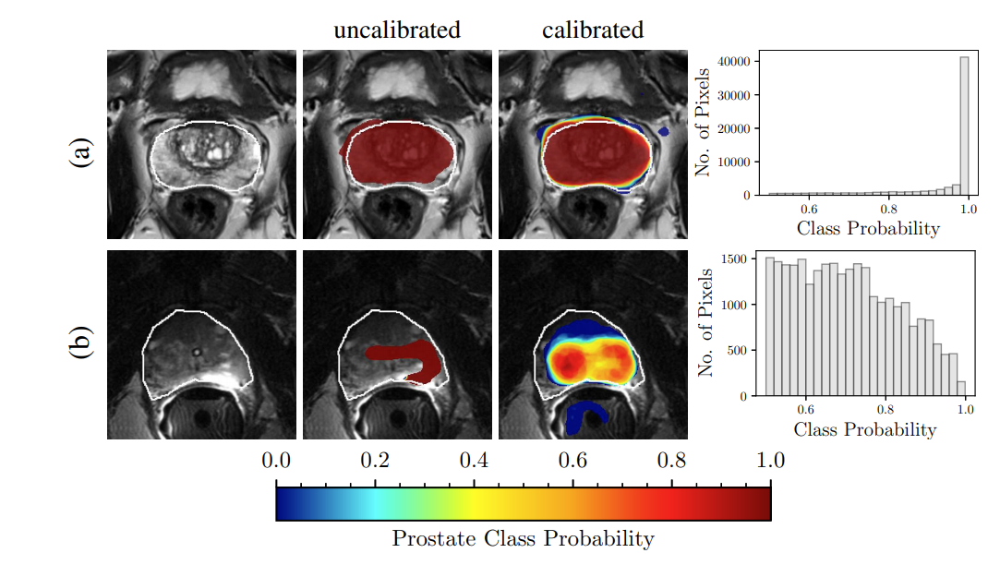
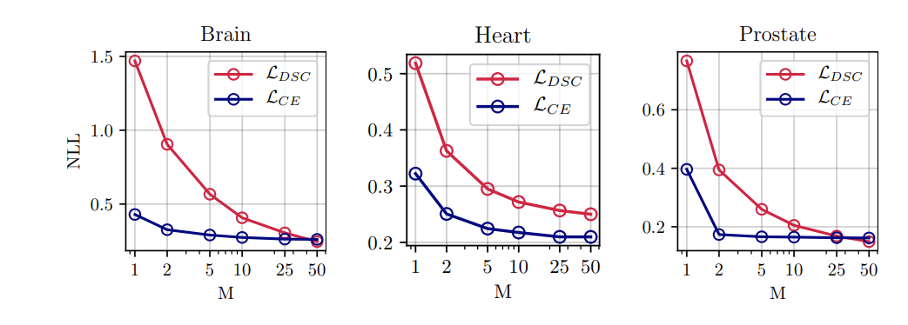
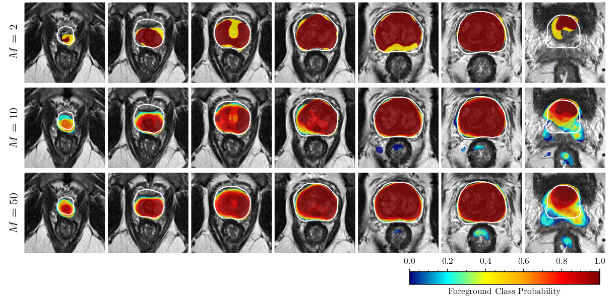
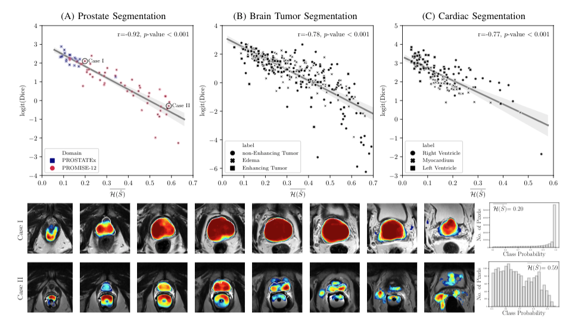

<!-- introduction -->
[Fully convolutional neural networks]() (FCNs), including the [U-Net]() and its variants, have been successfully used 
for segmentation of normal organs and lesions.
U-Net architecture has achieved top ranking results in several international segmentation challenges 
(e.g, , and ).
Moreover, [Batch Normalization]() (BN) and [Dice loss]() are often used in training to stabilize and accelerate optimization.
Networks trained with BN and Dice loss are often poorly calibrated.
[Miscalibration is a known issue in modern neural networks](https://arxiv.org/abs/1706.04599). 

Calibration is described as the ability of a decision-making system to provide an expectation of success (i.e. correct classification).
Using a frequentist interpretation of uncertainty, predictions (i.e. class probabilities) of a 
*well-calibrated* model should match the probability of success of those inferences in the long run.
For instance, if a well-calibrated brain tumor segmentation model classifies 100 pixels each with the 
probability of 0.7 as cancer,  we expect 70 of those pixels to be correctly classified as cancer. 
FCNs trained with Dice loss tend to produce overconfident predictions for both correct 
and erroneous classifications. Miscalibration results in models that are unreliable and hard to interpret.

In our recent [IEEE TMI](https://www.embs.org/tmi/) paper [“Confidence Calibration and Predictive Uncertainty Estimation for Deep Medical 
Image Segmentation”](https://arxiv.org/abs/1911.13273), we propose model ensembling for confidence 
calibration of the FCNs.
We also propose to use average entropy over the predicted segmented object as a metric to predict segmentation quality
of foreground structures, which can be further used to detect out-of-distribution test inputs.
We conduct extensive experiments across three medical image segmentation applications
of the brain, the heart, and the prostate to evaluate our contributions.

<figure class="figure">
  
  <figcaption class="figure-caption">A caption for the above image.</figcaption>
</figure>

##### Dice loss vs Cross Entropy (CE)
We start by comparing baselines trained with cross-entropy (CE) loss and Dice loss in terms 
segmentation quality and predictive uncertainty estimation.

##### Calibration by Ensembling
By training collections of FCNs with random initialization of parameters and random shuffling of training data, 
we create an ensemble that improves both segmentation quality and uncertainty estimation.

We propose [ensembling]() for confidence calibration of poorly calibrated FCNs trained with Dice loss. 
To do so, similar to the [Deep Ensembles method](), we train $$M$$ FCNs with random initialization 
of the network parameters and random shuffling of the training dataset in mini-batch stochastic gradient descent. 
We train each of the $$M$$ models in the ensemble from scratch and then compute the probability of 
the ensemble as the average of the baseline probabilities as follows.

Without ensembling, we observe that FCNs trained with Dice loss perform significantly 
better segmentation compared to those trained with cross-entropy but at the cost of poor calibration.

<figure class="figure">
  
  <figcaption class="figure-caption">A caption for the above image.</figcaption>
</figure>

<figure class="figure">
  
  <figcaption class="figure-caption">A caption for the above image.</figcaption>
</figure>

##### Comparison with MC Dropout
We also compare ensembling with [MC dropout](). 
We empirically quantify the effect of the number of models on calibration and segmentation quality.

##### Segment-level Predictive Uncertainty Estimation
For segmentation applications, besides the pixel-level confidence metric, 
it is desirable to have a confidence metric that captures model uncertainty at the segment-level.
Such a metric would be very useful in clinical applications for decision making.
For a well-calibrated system, we anticipate that a segment-level confidence metric can predict the segmentation quality in the absence of ground truth. 
The metric can be used to detect out-of-distribution samples and hard or ambiguous cases.
Given the pixel-level class predictions $$\hat{y}_i$$ and their associated ground truth class 
$$y_i$$ for a predicted segment $$\hat{\mathcal{S}}_k = \{s \in (x_i, \hat{y}_i) | \hat{y}_i=k \}$$, 
we propose to use the average of pixel-wise entropy values over the predicted foreground:

$$\overline{\mathcal{H}(\hat{\mathcal{S}}_k)} = - \frac{1}{\left|\hat{\mathcal{S}}_k\right|} \sum_{i\in \hat{\mathcal{S}}_k} 
[p(\hat{y}_i=k| x_i,\theta)\cdot \ln{\left(p(\hat{y}_i=k|x_i,\theta)\right)} + \\
     \left(1- p(\hat{y}_i=k| x_i,\theta) \right) \cdot \ln{\left(1-p(\hat{y}_i=k|x_i,\theta)\right)}].$$
     
In calculating the average entropy of $$\hat{\mathcal{S}}_k$$, we assumed binary classification: 
the probability of belonging to class $$k$$, $$p(\hat{y}_i=k| x_i, \theta)$$ 
and the probability of belonging to other classes $$1 - p(\hat{y}_i=k| x_i, \theta)$$.

For each of the segmentation problems, we calculated volume-level confidence for each of the foreground labels and $\overline{\mathcal{H(\hat{\mathcal{S})}}}$ (Equation \ref{eq:avg_entr}) vs. Dice.
For prostate segmentation, we are also interested in observing the difference between the two datasets of PROSTATEx test set (which is the same as the source domain) and PROMISE-12 set (which can be considered as a target set).

<figure class="figure">
  
  <figcaption class="figure-caption">A caption for the above image.</figcaption>
</figure>

##### Segmentation Quality

##### Conclusion
We conclude that model ensembling can be used successfully for confidence calibration of FCNs trained with Dice Loss.
Also, the proposed average entropy metric can be used as an effective predictive metric for estimating the performance 
of the model at test-time when the ground-truth is unknown.

    Share this on &rarr;
    <a href="https://twitter.com/intent/tweet?text={{ page.title }}&url={{ site.url }}{{ page.url }}&via={{ site.twitter_username }}&related={{ site.twitter_username }}" rel="nofollow" target="_blank" title="Share on Twitter">Twitter</a>
    <a href="https://facebook.com/sharer.php?u={{ site.url }}{{ page.url }}" rel="nofollow" target="_blank" title="Share on Facebook">Facebook</a>
    <a href="https://plus.google.com/share?url={{ site.url }}{{ page.url }}" rel="nofollow" target="_blank" title="Share on Google+">Google+</a>

