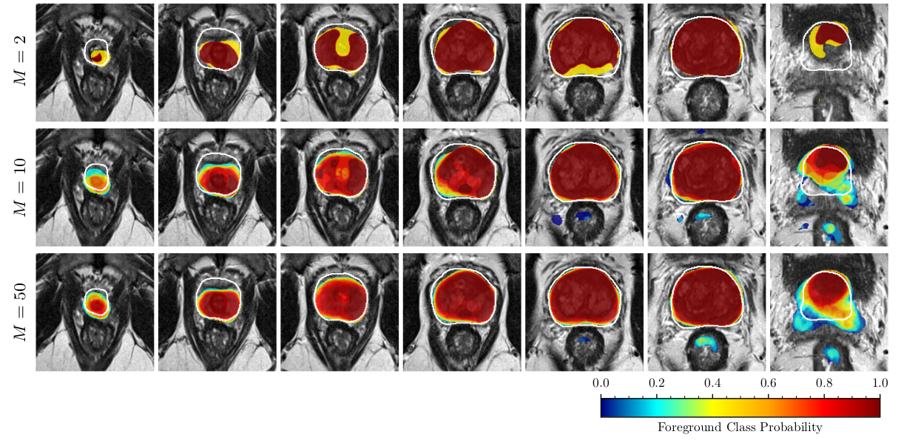

<!-- introduction -->
[Fully convolutional neural networks](https://arxiv.org/abs/1411.4038) (FCNs) have been successfully used 
in medical image analysis for semantic segmentation of normal organs and lesions.
The [U-Net](https://arxiv.org/abs/1505.04597), which is arguably the most popular architecture in medical image segmentation, 
has achieved top ranking results in several segmentation challenges.
Additionally, [Batch Normalization](https://arxiv.org/abs/1502.03167) (BN) and 
[Dice loss](https://arxiv.org/abs/1606.04797) are often used to stabilize and accelerate training.
Models trained with BN tend to be [less calibrated](https://arxiv.org/abs/1706.04599) compared to those trained without BN.
Also, [empirical results on cardiac MRI segmentation](https://arxiv.org/abs/1809.10430) suggest that 
networks trained with Dice loss are often poorly calibrated.
[Miscalibration is a known issue in modern neural networks](https://arxiv.org/abs/1706.04599). 

Calibration is described as the ability of a decision-making system to provide an expectation of success (i.e. correct classification).
Using a frequentist interpretation of uncertainty, predictions (i.e. class probabilities) of a 
*well-calibrated* model should match the probability of success of those inferences in the long run.
For instance, if a well-calibrated brain tumor segmentation model classifies 100 pixels each with the 
probability of 0.7 as cancer,  we expect 70 of those pixels to be correctly classified as cancer. 
Miscalibration results in models that are unreliable and hard to interpret.
In some domains, for example, medical applications, or automated driving, [overconfidence can be dangerous](https://arxiv.org/abs/1606.06565).

In our recent [IEEE TMI](https://ieeexplore.ieee.org/document/9130729) paper [“Confidence Calibration and Predictive Uncertainty Estimation for Deep Medical 
Image Segmentation”](https://arxiv.org/abs/1911.13273), we study predictive uncertainty 
estimation in FCNs for medical image segmentation.
We propose model ensembling for calibration of FCNs trained with Dice loss.
We also present an entropy-based metric to predict the segmentation quality of foreground structures at inference time,
which can be also used to detect out-of-distribution samples.
We conduct experiments across three medical image segmentation applications
of the [brain](https://www.med.upenn.edu/sbia/brats2017/data.html), 
the [heart](https://www.creatis.insa-lyon.fr/Challenge/acdc/), 
and the [prostate](http://isgwww.cs.uni-magdeburg.de/cas/isbi2018/) to evaluate our contributions.

<figure class="figure">
  
  <figcaption class="figure-caption">
  Examples of uncertainty estimation quality for prostate segmentation using cross-entropy (CE) loss, Dice loss, and 
  Ensemble of Dice.
  MRI images are overlaid with class probabilities, and reliability diagrams (together with ECE%, NLL,
  and Brier score) are given for that specific volume. 
  In the reliability diagrams, only the bins with greater than 1000 samples are shown. 
  Ensembling significantly improves the calibration qualities of FCNs trained with Dice Loss.
  On average, for the bounding box around the prostate gland, ensembling reduced negative log-likelihood 
  from 0.74 to 0.15 (n=20 cases).
 </figcaption>
</figure>

#### Metrics for Calibration Quality Assessment
We use 
[Negative Log-Likelihood (NLL)](https://scikit-learn.org/stable/modules/generated/sklearn.metrics.log_loss.html), 
[Brier score](https://en.wikipedia.org/wiki/Brier_score),  and 
[reliability diagrams](https://arxiv.org/abs/1706.04599) for evaluating calibration and uncertainty estimation.
We also use [Expected Calibration Error (ECE)](https://www.ncbi.nlm.nih.gov/pmc/articles/PMC4410090/)
as a quantitative summary of the reliability diagrams.

#### Dice loss vs Cross-Entropy (CE)
We start by comparing baselines trained with weighted cross-entropy (CE) loss 
with those that were trained with Dice loss in terms 
of segmentation quality and predictive uncertainty estimation.
We consistently observe that FCNs trained with Dice loss perform better segmentation compared to 
those trained with CE (in terms of Dice score and Hausdorff distance) but at the cost of worse calibration
(in terms of NLL and ECE%).

#### Calibration by Ensembling
We propose [ensembling](https://web.engr.oregonstate.edu/~tgd/publications/mcs-ensembles.pdf) for confidence calibration of poorly calibrated FCNs trained with Dice loss. 
Similar to the [Deep Ensembles](https://arxiv.org/abs/1612.01474) method, 
we train $$M$$ FCNs from scratch, with random initialization 
of the network parameters and random shuffling of the training dataset (using different random seeds 
for each of the baselines).
However, unlike the Deep Ensemble method, we do not use any form of adversarial training.
At inference time, we compute the probability of the ensemble as the average of the baseline probabilities.
We observe that ensembling significantly improves the calibration of models, specifically those that
were trained with Dice loss. For instance, for the prostate, the heart, and the brain tumor segmentation, 
using even five ensembles (M=5) of baselines trained with Dice loss can reduce the NLL by 
about 66%, 44%, and 62%, respectively.

<figure class="figure">
  
  <figcaption class="figure-caption">
  	Qualitative examples of improvements in calibration and segmentation as a function of the number of models M
  	in the ensemble of models trained with cross-entropy loss. 
  	The overlaid probability maps show the results of inference for an ensemble of size M=2, M=10, and  M=50. 
  	The white line shows the ground truth boundary of the structures.
  </figcaption>
</figure>

#### Comparison with MC Dropout
[Monte Carlo dropout (MC dropout)](https://arxiv.org/abs/1506.02142) is widely used 
for the uncertainty estimation of deep networks.
In this method dropout layers are applied at certain layers during the training time.
At test time, the probabilistic Gaussian process (uncertainty) is approximated 
by running the model several times with active dropout layers.
Here, we also compared ensembling with [MC dropout](https://arxiv.org/abs/1511.02680). 
We observe that in all cases ensembling outperforms MC dropout models in 
terms of calibration and segmentation quality.
Another benefit of ensembling over MC dropout is that it does not enforce the use of dropout layers.

#### Segment-level Predictive Uncertainty Estimation
It is often desirable to have a confidence metric that captures model uncertainty at the segment-level
of a test image volume.
Let's assume that we have a pelvic MRI volume and we use a deep model to segment the prostate gland.
If we have access to the ground truth, we can calculate the Dice score of the prostate and 
describe the performance of the model for this specific example with a scalar metric.
But what if we don't have access to the ground truth.
Is there any way to come up with a scalar metric that is a good representative of the segmentation quality
of the predicted prostate gland?
In other words, we seek a metric that has an acceptable correlation with Dice score and can be calculated 
at test-time without any knowledge of the ground truth.
Such a metric would be useful in the clinical deployment of deep models.
Here, we propose an entropy-based metric as a segment-level uncertainty estimation tool.
Given the pixel-level class predictions $$\hat{y}_i$$ and their associated ground truth class 
$$y_i$$ for a predicted segment $$\hat{\mathcal{S}}_k = \{s \in (x_i, \hat{y}_i) | \hat{y}_i=k \}$$, 
we propose to use the average of pixel-wise entropy values over the predicted foreground:

$$\overline{\mathcal{H}(\hat{\mathcal{S}}_k)} = - \frac{1}{\left|\hat{\mathcal{S}}_k\right|} \sum_{i\in \hat{\mathcal{S}}_k} 
[p(\hat{y}_i=k| x_i,\theta)\cdot \ln{\left(p(\hat{y}_i=k|x_i,\theta)\right)} + \\
     \left(1- p(\hat{y}_i=k| x_i,\theta) \right) \cdot \ln{\left(1-p(\hat{y}_i=k|x_i,\theta)\right)}].$$
     
In calculating the average entropy of $$\hat{\mathcal{S}}_k$$, we assumed binary classification: 
the probability of belonging to class $$k$$, $$p(\hat{y}_i=k| x_i, \theta)$$ 
and the probability of belonging to other classes $$1 - p(\hat{y}_i=k| x_i, \theta)$$.

We calculate segment-level confidence for each of the foreground 
labels and plot the $$\overline{\mathcal{H(\hat{\mathcal{S})}}}$$ vs. Dice.
We observed a strong correlation between Dice coefficient and average of entropy over the predicted segment.
Hence, $$\overline{\mathcal{H(\hat{\mathcal{S})}}}$$ can be used as a useful metric for 
predicting the segmentation quality of the predictions at test-time.
Higher entropy means less confidence in predictions and more inaccurate classifications leading 
to poorer Dice coefficients.

<figure class="figure">
  
  <figcaption class="figure-caption">
 Scatter plots and linear regression between the logit of Dice coefficient and the average of entropy over the predicted segment.
 Left: prostate gland segmentation. Middle: Brain tumor and edema segmentation.
 Right: Cardiac MRI segmentation.
 For the majority of the cases in all three segmentation tasks, the average entropy correlates well with the Dice coefficient, 
 meaning that it can be used as a reliable metric for predicting the segmentation quality of the predictions at test-time.
 Higher entropy means less confidence in predictions and more inaccurate classifications leading to poorer Dice coefficients.
 However, in all three tasks, there are few cases that can be considered outliers. 
 </figcaption>
</figure>

#### Out-of-distribution Detection
Another important aspect of uncertainty estimation  is the ability of a predictive model to distinguish 
*in-distribution* test examples (i.e. those similar to the training data) from 
*out-of-distribution* (OOD) test examples (i.e. those that do not fit the distribution of the training data).
In medical imaging applications as deep networks are often [sensitive to *domain shift*](https://arxiv.org/abs/1702.07841).
For instance, networks trained on one MRI protocol often do not perform satisfactorily on images obtained with slightly different parameters or OOD test images.
Hence, in the face of an OOD sample, an ideal model knows
and announces *"I do not know"* and seeks human intervention, if possible, instead of a silent failure.

In our experiments, we use two public datasets: 
PROSTATEx ([images](https://wiki.cancerimagingarchive.net/display/Public/SPIE-AAPM-NCI+PROSTATEx+Challenges), 
[labels](http://isgwww.cs.uni-magdeburg.de/cas/isbi2018/)) and [PROMISE12](https://promise12.grand-challenge.org/). 
PROSTATEx dataset was used for training, while PROMISE12 dataset was set aside for test only.
PROSTATEx dataset was collected in a single institute and all the images were acquired using phased-array coils.
PROMISE12 dataset is a heterogeneous multi-institutional dataset acquired using different 
MR scanners and acquisition parameters.
As a result of domain shift, models trained on phased-array coils do not work well on images acquired with
endorectal coils and sometimes they fail drastically.  
We observe that calibrated FCNs have the potential to detect OOD samples.

<figure class="figure">
  
  <figcaption class="figure-caption">
  Out-of-distribution detection:
  In the left scatter plot, samples are marked by their domain: PROSTATEx (source domain), 
  and the multi-device multi-institutional PROMISE12 dataset (target domain).
  As expected, on average, the source domain performs much better than the target domain, 
  meaning that average entropy can be used to flag out-of-distribution samples.
  The two bottom rows correspond to two of the cases from the PROMISE12 dataset are marked in scatter plot: 
  Case I and Case II; These show the prostate T2-weighted MRI at different locations of the same patient with 
  overlaid calibrated class probabilities (confidences) and histograms depicting distribution of probabilities over the segmented regions.  
  The white boundary overlay on prostate denotes the ground truth.
  The wider probability distribution in Case II associates with a higher average entropy which correlates with a lower Dice score.
  Case-I was imaged with phased-array coil (same as the images that was used for training the models), 
  while Case II was imaged with endorectal coil (out-of-distribution case in terms of imaging parameters). 
  </figcaption>
</figure>

<!-- ##### Segmentation Quality -->

##### Conclusions
Model ensembling is effective not only for improving the segmentation quality but also for confidence calibration. 
It significantly improves the calibration qualities of FCNs trained with Dice Loss and BN.
Also, the average entropy of the predicted segments correlates with the Dice score.  
Hence, it can be used as an effective metric for predicting the test-time performance when the ground-truth is unknown.
<!-- - Well-calibrated models can detect out-of-distribution examples and predict failures. -->

If you are interested, you can read the full paper on 
[IEEE TMI](https://ieeexplore.ieee.org/document/9130729/keywords#keywords) or the preprint on [arXiv](https://arxiv.org/abs/1911.13273).

    Share this post on &rarr;
    <a href="https://twitter.com/intent/tweet?text={{ page.title }}&url={{ site.url }}{{ page.url }}&via={{ site.twitter_username }}&related={{ site.twitter_username }}" rel="nofollow" target="_blank" title="Share on Twitter">Twitter</a> |
    <a href="https://www.linkedin.com/shareArticle?mini=true&url={{ page.url | absolute_url | url_encode }}">LinkedIn</a> |
    <a href="https://facebook.com/sharer.php?u={{ site.url }}{{ page.url }}" rel="nofollow" target="_blank" title="Share on Facebook">Facebook</a>

<!-- hr -->

